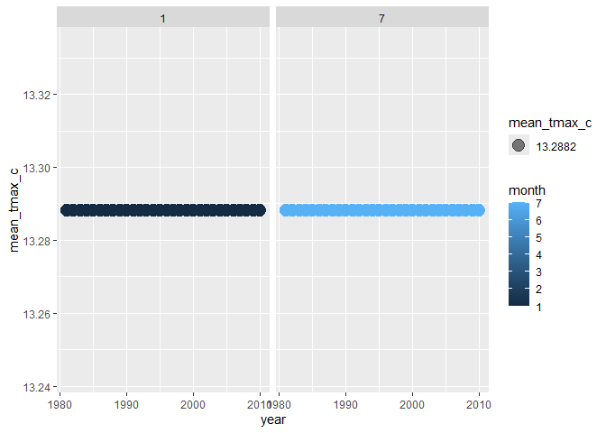

Homework 3
================

# **Problem 1**

## Part 1: Loading data set & understanding it

#### Load in NY NOAA dataset from p8105 website

``` r
library(p8105.datasets)
data("ny_noaa")
str(ny_noaa)
```

    ## Classes 'tbl_df', 'tbl' and 'data.frame':    2595176 obs. of  7 variables:
    ##  $ id  : chr  "US1NYAB0001" "US1NYAB0001" "US1NYAB0001" "US1NYAB0001" ...
    ##  $ date: Date, format: "2007-11-01" "2007-11-02" ...
    ##  $ prcp: int  NA NA NA NA NA NA NA NA NA NA ...
    ##  $ snow: int  NA NA NA NA NA NA NA NA NA NA ...
    ##  $ snwd: int  NA NA NA NA NA NA NA NA NA NA ...
    ##  $ tmax: chr  NA NA NA NA ...
    ##  $ tmin: chr  NA NA NA NA ...
    ##  - attr(*, "spec")=List of 2
    ##   ..$ cols   :List of 7
    ##   .. ..$ id  : list()
    ##   .. .. ..- attr(*, "class")= chr [1:2] "collector_character" "collector"
    ##   .. ..$ date:List of 1
    ##   .. .. ..$ format: chr ""
    ##   .. .. ..- attr(*, "class")= chr [1:2] "collector_date" "collector"
    ##   .. ..$ prcp: list()
    ##   .. .. ..- attr(*, "class")= chr [1:2] "collector_integer" "collector"
    ##   .. ..$ snow: list()
    ##   .. .. ..- attr(*, "class")= chr [1:2] "collector_integer" "collector"
    ##   .. ..$ snwd: list()
    ##   .. .. ..- attr(*, "class")= chr [1:2] "collector_integer" "collector"
    ##   .. ..$ tmax: list()
    ##   .. .. ..- attr(*, "class")= chr [1:2] "collector_character" "collector"
    ##   .. ..$ tmin: list()
    ##   .. .. ..- attr(*, "class")= chr [1:2] "collector_character" "collector"
    ##   ..$ default: list()
    ##   .. ..- attr(*, "class")= chr [1:2] "collector_guess" "collector"
    ##   ..- attr(*, "class")= chr "col_spec"

``` r
sum(is.na(ny_noaa))
```

    ## [1] 3387623

#### Description of data

This data set has about 2.6 million observations and 7 variables. The
variable names, order, and variable type are as follows:

id: weather station ID–*character variable type*

date: date of observation- *date variable type*

prcp: precipitation (tenths of mm)- *integer variable type*

snow: snowfall (mm)- *integer variable type* snwd: snow depth (mm)-
*integer variable type*

tmax: maximum temperature (tenths of degrees C)- *character variable
type*

tmin: minimum temperature (tenths of degrees C)- *character variable
type*

Key variables include ‘id’ and ‘date’. ‘id’ is a key variable as it can
be used to group weather stations and ‘date’ is a key variable because
it can help filter information from a specific date range.

There are values missing for observations throughout the dataset, in
total there 3,387,623 missing values across all variables. Missing
values are identified by “NA.” ‘id’ and ‘date’ are not missing for any
observation. ‘tmax’ and ‘tmin’ have the most missing values with
1,134,358 and 1,134,420 values missing, respectively.

## Part 2: Data Cleaning

Separating the date into month, day, and year. Also converting units of
prcp from 1/10 of a mm to a mm by making a new variable ‘prcp_mm’. Now,
precipitation and snowfall are in the same units. Also, adjusted units
of tmax and tmin to make them easier to understand–units are now in
degrees Celsius.

``` r
library(tidyr)
library(dplyr)
```

    ## 
    ## Attaching package: 'dplyr'

    ## The following objects are masked from 'package:stats':
    ## 
    ##     filter, lag

    ## The following objects are masked from 'package:base':
    ## 
    ##     intersect, setdiff, setequal, union

``` r
ny_noaa_working = ny_noaa %>% 
  separate(date, into = c("year", "month", "day"), sep = "-") %>% 
  mutate(prcp_mm = prcp/10) %>% 
  mutate(tmax = as.integer(tmax)) %>% 
  mutate(tmin = as.integer(tmin)) %>% 
  mutate(tmax_c = tmax/10) %>% 
  mutate(tmin_c = tmin/10)
```

Now, to understand what the most commonly observed value for snowfall
are we will use the following code:

``` r
ny_noaa_working %>% 
  group_by(snow) %>% 
  summarize(n_obs = n())
```

    ## # A tibble: 282 × 2
    ##     snow   n_obs
    ##    <int>   <int>
    ##  1   -13       1
    ##  2     0 2008508
    ##  3     3    8790
    ##  4     5    9748
    ##  5     8    9962
    ##  6    10    5106
    ##  7    13   23095
    ##  8    15    3672
    ##  9    18    3226
    ## 10    20    4797
    ## # ℹ 272 more rows

The most commonly observed value for snowfall is 0mm, the description of
the NOAA dataset mentions that “about one half of the stations report
precipitation only” which may be why the highest observed value is 0mm,
because those stations don’t report snowfall. Additionally, some of the
areas where the stations are located may be areas where it does not
snow.

## Part 3: Two-panel plot of avg. max temperature

``` r
library(ggplot2)

ny_noaa_working = ny_noaa_working %>% 
  mutate(month = as.integer(month)) %>% 
  mutate(year = as.integer(year)) %>% 
  mutate(day = as.integer(day))

ny_noaa_janjul = ny_noaa_working %>% 
  filter(month %in% c(1,7)) %>% 
  mutate (
    mean_tmax_c = mean(tmax_c, na.rm = TRUE)
  )

ggplot(ny_noaa_janjul, aes(x = year, y = mean_tmax_c, color = month)) + 
  geom_point(aes(size = mean_tmax_c), alpha =.5) +
  facet_grid(. ~ month)
```

<!-- -->
\### **Problem 2** \## Part 1: \#### Load, tidy, organize data

``` r
library(readr)
library(tidyr)

demographic = read_csv("./Data_HW3/nhanes_covar.csv", skip = 4)
```

    ## Rows: 250 Columns: 5
    ## ── Column specification ────────────────────────────────────────────────────────
    ## Delimiter: ","
    ## dbl (5): SEQN, sex, age, BMI, education
    ## 
    ## ℹ Use `spec()` to retrieve the full column specification for this data.
    ## ℹ Specify the column types or set `show_col_types = FALSE` to quiet this message.

``` r
accel = read_csv("./Data_HW3/nhanes_accel.csv")
```

    ## Rows: 250 Columns: 1441
    ## ── Column specification ────────────────────────────────────────────────────────
    ## Delimiter: ","
    ## dbl (1441): SEQN, min1, min2, min3, min4, min5, min6, min7, min8, min9, min1...
    ## 
    ## ℹ Use `spec()` to retrieve the full column specification for this data.
    ## ℹ Specify the column types or set `show_col_types = FALSE` to quiet this message.

``` r
demographic = demographic %>% 
  filter(age >= 21) %>% 
  drop_na() %>% 
  mutate(
    sex = factor(sex, levels = c(1, 2), labels = c("Male", "Female")),
    education = factor(education, levels = c(1, 2, 3), 
                       labels = c("Less than High School", 
                                  "High School Equivalent", 
                                  "More than High School")))
```

## Part 2:

#### Table of men and women in each edu. category

``` r
education_by_sex = demographic %>%
  group_by(education, sex) %>%
  summarize(count = n(), .groups = 'drop') %>%
  pivot_wider(names_from = sex, values_from = count, values_fill = list(count = 0)) %>% 
  knitr::kable(digits =1)
```

#### Visualization of age distributions

## Part 3:

#### Aggregrate across minutes to create total activity variable for each participant

#### Plot

## Part 4:

#### Three-panel plot

#### Description & Conclusion

### **Problem 3**
