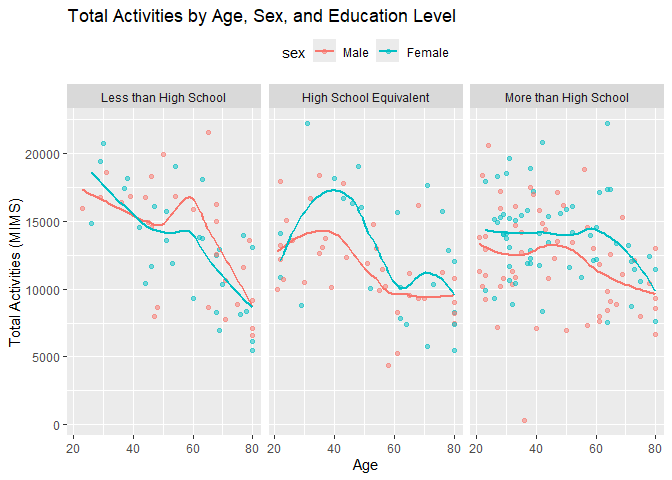

Homework 3
================

# **Problem 1**

## Part 1: Loading data set & understanding it

#### Load in NY NOAA dataset from p8105 website

``` r
library(p8105.datasets)
data("ny_noaa")
str(ny_noaa)
```

    ## Classes 'tbl_df', 'tbl' and 'data.frame':    2595176 obs. of  7 variables:
    ##  $ id  : chr  "US1NYAB0001" "US1NYAB0001" "US1NYAB0001" "US1NYAB0001" ...
    ##  $ date: Date, format: "2007-11-01" "2007-11-02" ...
    ##  $ prcp: int  NA NA NA NA NA NA NA NA NA NA ...
    ##  $ snow: int  NA NA NA NA NA NA NA NA NA NA ...
    ##  $ snwd: int  NA NA NA NA NA NA NA NA NA NA ...
    ##  $ tmax: chr  NA NA NA NA ...
    ##  $ tmin: chr  NA NA NA NA ...
    ##  - attr(*, "spec")=List of 2
    ##   ..$ cols   :List of 7
    ##   .. ..$ id  : list()
    ##   .. .. ..- attr(*, "class")= chr [1:2] "collector_character" "collector"
    ##   .. ..$ date:List of 1
    ##   .. .. ..$ format: chr ""
    ##   .. .. ..- attr(*, "class")= chr [1:2] "collector_date" "collector"
    ##   .. ..$ prcp: list()
    ##   .. .. ..- attr(*, "class")= chr [1:2] "collector_integer" "collector"
    ##   .. ..$ snow: list()
    ##   .. .. ..- attr(*, "class")= chr [1:2] "collector_integer" "collector"
    ##   .. ..$ snwd: list()
    ##   .. .. ..- attr(*, "class")= chr [1:2] "collector_integer" "collector"
    ##   .. ..$ tmax: list()
    ##   .. .. ..- attr(*, "class")= chr [1:2] "collector_character" "collector"
    ##   .. ..$ tmin: list()
    ##   .. .. ..- attr(*, "class")= chr [1:2] "collector_character" "collector"
    ##   ..$ default: list()
    ##   .. ..- attr(*, "class")= chr [1:2] "collector_guess" "collector"
    ##   ..- attr(*, "class")= chr "col_spec"

``` r
sum(is.na(ny_noaa))
```

    ## [1] 3387623

#### Description of data

This data set has about 2.6 million observations and 7 variables. The
variable names, order, and variable type are as follows:

id: weather station ID–*character variable type*

date: date of observation- *date variable type*

prcp: precipitation (tenths of mm)- *integer variable type*

snow: snowfall (mm)- *integer variable type* snwd: snow depth (mm)-
*integer variable type*

tmax: maximum temperature (tenths of degrees C)- *character variable
type*

tmin: minimum temperature (tenths of degrees C)- *character variable
type*

Key variables include ‘id’ and ‘date’. ‘id’ is a key variable as it can
be used to group weather stations and ‘date’ is a key variable because
it can help filter information from a specific date range.

There are values missing for observations throughout the dataset, in
total there 3,387,623 missing values across all variables. Missing
values are identified by “NA.” ‘id’ and ‘date’ are not missing for any
observation. ‘tmax’ and ‘tmin’ have the most missing values with
1,134,358 and 1,134,420 values missing, respectively.

## Part 2: Data Cleaning

Separating the date into month, day, and year. Also converting units of
prcp from 1/10 of a mm to a mm by making a new variable ‘prcp_mm’. Now,
precipitation and snowfall are in the same units. Also, adjusted units
of tmax and tmin to make them easier to understand–units are now in
degrees Celsius.

``` r
library(tidyr)
library(dplyr)
```

    ## 
    ## Attaching package: 'dplyr'

    ## The following objects are masked from 'package:stats':
    ## 
    ##     filter, lag

    ## The following objects are masked from 'package:base':
    ## 
    ##     intersect, setdiff, setequal, union

``` r
ny_noaa_working = ny_noaa %>% 
  separate(date, into = c("year", "month", "day"), sep = "-") %>% 
  mutate(prcp_mm = prcp/10) %>% 
  mutate(tmax = as.integer(tmax)) %>% 
  mutate(tmin = as.integer(tmin)) %>% 
  mutate(tmax_c = tmax/10) %>% 
  mutate(tmin_c = tmin/10)
```

Now, to understand what the most commonly observed value for snowfall
are we will use the following code:

``` r
ny_noaa_working %>% 
  group_by(snow) %>% 
  summarize(n_obs = n())
```

    ## # A tibble: 282 × 2
    ##     snow   n_obs
    ##    <int>   <int>
    ##  1   -13       1
    ##  2     0 2008508
    ##  3     3    8790
    ##  4     5    9748
    ##  5     8    9962
    ##  6    10    5106
    ##  7    13   23095
    ##  8    15    3672
    ##  9    18    3226
    ## 10    20    4797
    ## # ℹ 272 more rows

The most commonly observed value for snowfall is 0mm, the description of
the NOAA dataset mentions that “about one half of the stations report
precipitation only” which may be why the highest observed value is 0mm,
because those stations don’t report snowfall. Additionally, some of the
areas where the stations are located may be areas where it does not
snow.

## Part 3: Two-panel plot of avg. max temperature

# **Problem 2**

## Part 1:

#### Load, tidy, organize data

``` r
library(readr)
library(tidyr)

demographic = read_csv("./Data_HW3/nhanes_covar.csv", skip = 4)
```

    ## Rows: 250 Columns: 5
    ## ── Column specification ────────────────────────────────────────────────────────
    ## Delimiter: ","
    ## dbl (5): SEQN, sex, age, BMI, education
    ## 
    ## ℹ Use `spec()` to retrieve the full column specification for this data.
    ## ℹ Specify the column types or set `show_col_types = FALSE` to quiet this message.

``` r
accel = read_csv("./Data_HW3/nhanes_accel.csv")
```

    ## Rows: 250 Columns: 1441
    ## ── Column specification ────────────────────────────────────────────────────────
    ## Delimiter: ","
    ## dbl (1441): SEQN, min1, min2, min3, min4, min5, min6, min7, min8, min9, min1...
    ## 
    ## ℹ Use `spec()` to retrieve the full column specification for this data.
    ## ℹ Specify the column types or set `show_col_types = FALSE` to quiet this message.

``` r
demographic = demographic %>% 
  filter(age >= 21) %>% 
  drop_na() %>% 
  mutate(
    sex = factor(sex, levels = c(1, 2), labels = c("Male", "Female")),
    education = factor(education, levels = c(1, 2, 3), 
                       labels = c("Less than High School", 
                                  "High School Equivalent", 
                                  "More than High School")))

full_df = 
  left_join(demographic, accel, by = "SEQN")
```

## Part 2:

#### Table of men and women in each edu. category

``` r
education_by_sex = full_df %>%
  group_by(education, sex) %>%
  summarize(count = n(), .groups = 'drop') %>%
  pivot_wider(names_from = sex, values_from = count, values_fill = list(count = 0))
education_by_sex
```

    ## # A tibble: 3 × 3
    ##   education               Male Female
    ##   <fct>                  <int>  <int>
    ## 1 Less than High School     27     28
    ## 2 High School Equivalent    35     23
    ## 3 More than High School     56     59

For the Less than High School and the More than High School, there is
about an equal distribution of males and females. However, in the high
school equivalent there are more males then females.

#### Visualization of age distributions

``` r
ggplot(full_df, aes(x = age, fill = sex)) +
  geom_histogram(binwidth = 2, position = "dodge", alpha = 0.5) +
  facet_wrap(~ education, scales = "free_y") +
  labs(title = "Age Distribution by Sex and Education Category",
       x = "Age",
       y = "Count")
```

<!-- -->

Overall, the distribution of females and males in each category is
similar. In the ‘Less than High School’, individuals tend to be older,
especially for females. In the ‘More than High School’ category
individuals tend to be younger and the distribution of males and females
are similar.

## Part 3:

#### Aggregrate across minutes to create total activity variable for each participant

``` r
full_df = full_df %>%
  mutate(total_MIMS = rowSums(select(., min1:min1440), na.rm = TRUE)) %>% 
  select(SEQN, sex, age, BMI, education, total_MIMS, everything())
```

#### Plot: total activities (y-axis) against age (x-axis)

``` r
ggplot(full_df, aes(x = age, y = total_MIMS, color = sex)) +
  geom_point(alpha = 0.5) +  
  geom_smooth(se = FALSE) +
  facet_wrap(~ education) + 
  labs(title = "Total Activities by Age, Sex, and Education Level",
       x = "Age",
       y = "Total Activities (MIMS)") +
  theme(legend.position = "top")
```

    ## `geom_smooth()` using method = 'loess' and formula = 'y ~ x'

<!-- -->

For the ‘Less than High School’ education category, total activity
(MIMS) decreases as individuals age for both males and females. However,
both males and females have a slight increase in total activity around
the age of 60. In this education category, prior to the age of 40
females have a higher total activity compared to males. As individuals
age, overall males have a higher total activity compared to females.

For the ‘High school equivalent’ education category, both males and
females have an increase in total activity from the age of 20-40, with
females having a higher total activity during that range. From the age
of 40-60, both males and females decrease in total activity. For males,
from ages 60-80, total activity stays relatively stagnant while, during
that age, total activity slightly increases and then decrease for
females.

Finally, for the ‘More than High School’ education category, there is a
downward trend in total activity for both males and females but this
downward trend is less drastic than the downward trend seen in the ‘Less
than High School’ education category. In this education category, males
have a slight increase in total activity from ages 40-50 and females
have a slight increase in total activity from ages 50-60.

## Part 4: 24-hour activity time courses for each education level

``` r
pt4_data <- full_df %>%
  pivot_longer(cols = starts_with("min"), 
               names_to = "minute", 
               values_to = "activity") 

pt4_data <- pt4_data %>%
  mutate(minute = as.numeric(gsub("min", "", minute)))

ggplot(pt4_data, aes(x = minute/60, y = activity, color = sex)) +
  geom_smooth(aes(color = sex), se = FALSE, linetype = "solid") + #only included this for simplicity 
  facet_wrap(~ education, nrow = 3) +  
  labs(title = "24-Hour Activity Time Courses by Education Level",
       x = "Hour of the Day",
       y = "Activity Level")
```

    ## `geom_smooth()` using method = 'gam' and formula = 'y ~ s(x, bs = "cs")'

<!-- -->

For all education categories, activity level increases steadily from 5am
to 10am for both males and females–however, during this time females in
the ‘more than High School’ and ‘High school equivalent’ categories have
higher activity levels compared to males in those education categories.

For all education categories, activity level decrease steadily from 8pm
to midnight for both males and females. However, those in the ‘less than
high school’ education category begin to decrease in activity level
starting at 12pm while those in the ‘high school equivalent’ and ‘more
than High School’ begin to decrease activity level starting at 8pm.

Overall, females and males in the ‘less than High School’ and ‘high
school equivalent’ categories have similar activity levels throughout
the day. In the ‘more than High School’, females have lower activity
levels throughout the entire day compared to males.

# **Problem 3**

## Part 1:

#### import all data sets

``` r
library(readr)
library(tidyr)
library(dplyr)
library(ggplot2)

jan_2020 = read_csv("./Data_HW3/Jan 2020 Citi.csv")
```

    ## Rows: 12420 Columns: 7
    ## ── Column specification ────────────────────────────────────────────────────────
    ## Delimiter: ","
    ## chr (6): ride_id, rideable_type, weekdays, start_station_name, end_station_n...
    ## dbl (1): duration
    ## 
    ## ℹ Use `spec()` to retrieve the full column specification for this data.
    ## ℹ Specify the column types or set `show_col_types = FALSE` to quiet this message.

``` r
jan_2024 = read_csv("./Data_HW3/Jan 2024 Citi.csv")
```

    ## Rows: 18861 Columns: 7
    ## ── Column specification ────────────────────────────────────────────────────────
    ## Delimiter: ","
    ## chr (6): ride_id, rideable_type, weekdays, start_station_name, end_station_n...
    ## dbl (1): duration
    ## 
    ## ℹ Use `spec()` to retrieve the full column specification for this data.
    ## ℹ Specify the column types or set `show_col_types = FALSE` to quiet this message.

``` r
july_2020 = read_csv("./Data_HW3/July 2020 Citi.csv")
```

    ## Rows: 21048 Columns: 7
    ## ── Column specification ────────────────────────────────────────────────────────
    ## Delimiter: ","
    ## chr (6): ride_id, rideable_type, weekdays, start_station_name, end_station_n...
    ## dbl (1): duration
    ## 
    ## ℹ Use `spec()` to retrieve the full column specification for this data.
    ## ℹ Specify the column types or set `show_col_types = FALSE` to quiet this message.

``` r
july_2024 = read_csv("./Data_HW3/July 2024 Citi.csv")
```

    ## Rows: 47156 Columns: 7
    ## ── Column specification ────────────────────────────────────────────────────────
    ## Delimiter: ","
    ## chr (6): ride_id, rideable_type, weekdays, start_station_name, end_station_n...
    ## dbl (1): duration
    ## 
    ## ℹ Use `spec()` to retrieve the full column specification for this data.
    ## ℹ Specify the column types or set `show_col_types = FALSE` to quiet this message.

#### clean data sets

``` r
jan_2020 = jan_2020 %>% 
  mutate(month = 'Jan',
         year = '2020')

jan_2024 = jan_2024 %>% 
  mutate(month = 'Jan',
         year = '2024')

july_2020 = july_2020 %>% 
  mutate(month = 'July',
         year = '2020')

july_2024 = july_2024 %>% 
  mutate(month = 'July',
         year = '2024')
```

#### tidy the data sets

``` r
binded_df = 
  bind_rows(jan_2020, jan_2024, july_2020, july_2024) %>% 
  relocate(ride_id) %>% 
  arrange(ride_id)
```

The dataset ‘binded_df’ was created from the four datasets provided from
January 2020 & 2024 and July 2020 & 2024. Each entry has a unique
ride_id and includes the type of bike used (electric or classic), the
weekday the ride occurred, the duration of the ride in minutes, where
the ride started and ended, and if the rider was a member or not.
Additonally, two new variables were created for each data set, before
being merged. These variables are “month” and “year” that specify the
month and year that the observation is from.

The four datasets were merged using bind_rows since each observations
was unique. In the merged dataset, called ‘binded_df’ there are 99,485
observations and 9 variables.

## Part 2:

#### Reader-friendly table

``` r
summary_table_p3 = binded_df %>%
  group_by(year, month, member_casual) %>% 
  summarise(total_rides = n(), .groups = 'drop') %>%
  pivot_wider(names_from = member_casual, values_from = total_rides, values_fill = list(total_rides = 0))
summary_table_p3
```

    ## # A tibble: 4 × 4
    ##   year  month casual member
    ##   <chr> <chr>  <int>  <int>
    ## 1 2020  Jan      984  11436
    ## 2 2020  July    5637  15411
    ## 3 2024  Jan     2108  16753
    ## 4 2024  July   10894  36262

The table above shows the total number of rides each month/year and is
separated by causal and member riders. January 2020 has the smaller
number of causal riders and member riders while July 2024 has the
largest number of causal and member riders. Given the climate of these
months in New York City this makes sense. This may be also due to the
increase popularity of Citi Bike in the city from 2020 to 2024.
Additionally, across all four time periods, more member riders were
using Citi Bike compared to casual riders–likely due to the lower rental
rates for member riders.

## Part 3:

#### 5 most popular starting stations

``` r
pop_stations = binded_df %>%
  filter(year == "2024", month == "July") %>%
  group_by(start_station_name) %>% 
  summarise(tot_rides = n(), .groups = 'drop') %>% 
  arrange(desc(tot_rides))
head(pop_stations)
```

    ## # A tibble: 6 × 2
    ##   start_station_name       tot_rides
    ##   <chr>                        <int>
    ## 1 Pier 61 at Chelsea Piers       163
    ## 2 University Pl & E 14 St        155
    ## 3 W 21 St & 6 Ave                152
    ## 4 West St & Chambers St          150
    ## 5 W 31 St & 7 Ave                146
    ## 6 Broadway & E 21 St             142

## Part 4:

#### Plot: effect of day of week, month, amd year on median ride duration

``` r
median_p3 = binded_df %>%
  group_by(year, month, weekdays) %>%  
  summarise(median_p3 = median(duration, na.rm = TRUE), .groups = 'drop')

ggplot(median_p3, aes(x = weekdays, y = median_p3, color = as.factor(year))) +
  geom_line(aes(group = year), size = 1) +  
  facet_wrap(~ month, nrow = 2) + 
  labs(title = "Effects of Day of the Week, Month, and Year on Median Ride Duration",
       x = "Day of the Week",
       y = "Median Ride Duration (minutes)",
       color = "Year")
```

    ## Warning: Using `size` aesthetic for lines was deprecated in ggplot2 3.4.0.
    ## ℹ Please use `linewidth` instead.
    ## This warning is displayed once every 8 hours.
    ## Call `lifecycle::last_lifecycle_warnings()` to see where this warning was
    ## generated.

<!-- -->

Overall, median ride duration is higher in July than it is in January,
during both year–this makes sense given the climate of New York City
during these months. Additionally, during both months, ride duration is
higher on the weekends (Saturday & Sunday) across both years. We also
see that ride duration was higher, overall, across both months in 2020.
This may have been due to the COVID-19 pandemic, social isolation may
have increased the need for physical activity and time outside of the
home which may have increased ride duration.

## Part 5:

#### Plot: impact of month, membership status, and bike type on ride duration

``` r
data_2024 = binded_df %>%
  filter(year == '2024')  

ggplot(data_2024, aes(x = duration, fill = rideable_type)) +
  geom_histogram(binwidth = 1, position = "dodge", alpha = 0.7) +  
  facet_wrap(member_casual ~ month, nrow = 2) + 
  labs(title = "Distribution of Ride Duration by Month and Membership Status (2024)",
       x = "Ride Duration (minutes)",
       y = "Count",
       fill = "Bike Type")
```

<!-- -->

Across both boths and rider type (casual and members) electric bikes
were ridden more than classic bikes. In general, there were more rides
in July 2024 compared to January 2024. Additionally, in July 2024
electric bikes were ridden longer than classic bikes by riders.
